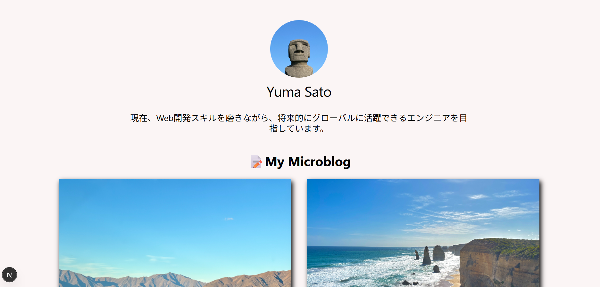
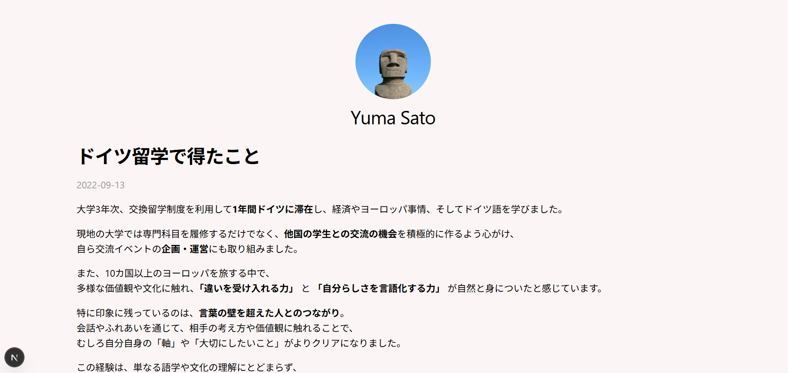

# Mini Microblog

## プロジェクト概要

このプロジェクトは、**Next.js（Pages Router）を使って構築したミニマイクロブログアプリ**です。  
シンプルな投稿表示機能を通じて、**静的サイト生成（SSG）や動的ルーティング、Reactの基礎構造**を実践的に学ぶことを目的としています。

## 使用技術

- Next.js（Pages Router）
- React
- JavaScript
- CSS Modules
- Vercel（デプロイ）

## 主な機能

- 投稿の一覧表示
- 投稿詳細ページ（動的ルーティング）
- getStaticPaths + getStaticProps を使った静的生成（SSG）

## 工夫した点

- pages ディレクトリを用いた構成で、ルーティングの基本理解を深めた  
- getStaticProps / getStaticPaths を用いてビルド時に投稿を静的生成  
- 投稿データはローカルファイルで管理し、MarkDownファイルに書いて表示

## 公開サイト

こちらからポートフォリオサイトをご覧いただけます：
[https://my-mini-blog-rosy.vercel.app/](https://my-mini-blog-rosy.vercel.app/)

## デザイン

### トップページ

### 投稿詳細ページ

## 連絡先

以下から気軽にご連絡ください：
- E-mail: [whoisyuma.0913@gmail.com](whoisyuma.0913@gmail.com)

## 備考

このアプリは学習用として作成しました。

# Mini Microblog

## Project Overview

This project is a **mini microblog application built using Next.js (Pages Router)**.  
It was created as a hands-on learning exercise to understand **Static Site Generation (SSG), dynamic routing, and the foundational structure of React** through a simple post display feature.

## Technologies Used

- Next.js (Pages Router)  
- React  
- JavaScript  
- CSS Modules  
- Vercel (for deployment)

## Key Features

- Display a list of posts  
- Dynamic routing for individual post detail pages  
- Static generation using `getStaticPaths` and `getStaticProps`

## Highlights / Learning Focus

- Deepened understanding of routing with the `pages` directory in Next.js  
- Implemented static site generation (SSG) using `getStaticProps` and `getStaticPaths`  
- Post content is managed locally using Markdown files and rendered as HTML

## Live Site

You can view the live site here:  
[https://my-mini-blog-rosy.vercel.app/](https://my-mini-blog-rosy.vercel.app/)

## Design

### Top Page (Post List)

### Post Detail Page

## Contact

Feel free to contact me:  
- E-mail: [whoisyuma.0913@gmail.com](mailto:whoisyuma.0913@gmail.com)

## Notes

This application was created for learning purposes.